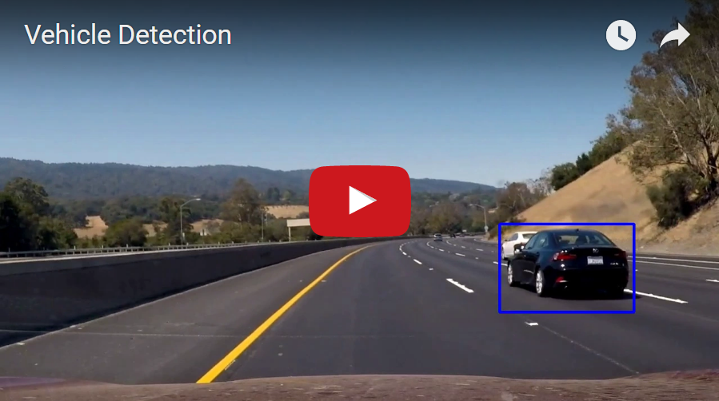

# Vehicle Detection

## In this project, the goal is to use computer vision techniques to detect vehicles on the road.

### Steps taken:

* Analysis of data - Car and Non-car images

* Apply an image transform to YCrCb and append binned color features, as well as histograms of color, to the HOG feature vector. This combined forms the feature.

* Train a Support Vector Machine classifier

* Implement a sliding-window and use the classifier to search the vehicle

* Generation of Heatmap with detection and bound box on vehicles

* Smooth the results and eliminate false positives in video

All the code implementation is present in the notebook **vehicle_detection.ipynb**. To run the code goto notebook and run !!

## Data Analysis:
These images have to be extracted from real world videos and images, and correctly labeled. Udacity provided 8.792 images of car and 8.968 images of non-cars, from sources listed in the attachments. The images have 64 x 64 pixels.

"

## The Feature extractor:

### Color Binning:
(Code in cell 3, function bin_spatial())

The image is conveted YCrCb and Spatial binning was done to resize the images to size 32*32 and the 3 channel values are concatenated.

### Color Features:
(Code in cell 3, function color_hist())

The image is converted to YCrCb and the corresponding channels values are appended together.

### HOG Features:
(Code in cell 3, function get_hog_features())

By playing with the parameters, I found that orientations of 9, and 8 pixels per cell are enough to identify a car in the YCrCb color space. The HOG was distinct for a car in the YCrCb space. The following are the final parameters chosen for HOG, Spatial Bins and Color Histograms:-
* Color Channel -  YCrCb
* Orientation bins - 9
* Pixels per cell - 8
* Cells per block - 2
* Histogram Bins - 32
* Spatial Image Size - (32, 32)
 
A sample hog feature can be shown in the figure below:

These parameters are present in cell no. 6 of vehicle_detection.ipynb. The function extract_features() combines all these features together to form our required feature. The feature extraction takes place in cell no 6. These features are normalised using the function StandardScaler()

## The classifier

The next step is to train a classifier. It receives the cars / non-cars data features, and returns if the data sample **IS** or **IS NOT** a Car. These data are separated in training (90%) and validation sets (10%), and their order is randomized to get a generalised model. The windows are highlighted when the classifier predicts a car as shown below:

I have trained my classifier using LinearSVC with 10000 samples in each of car and non-carthe cell no 8.

**Robust Classifier:**
In order to have a robust classifier some simple but efficient step were taken, namely
* The training data was randomised so as to prevent any biasing over time space, as some of the data is collected from the video on which it is being tested on. Randomization helped better the classifer.

* The features on which it the classifier was trained consisted of 3 unique features, namely the spacital binning to get the raw color information, the color histogram and the HOG features to get the shape information. Combining all these 3 unique features into one feature and normalising the feature set to 0 mean and unit variance.

## Applying the classifier in an image frame
The car can appear in different sizes so different window sizes are required to detect the car. I have used scales of 1.3, 1.5, 1.8 which corresponds to window of 83, 96 and 115 respectively as defined find_cars() function in the cell no 14.

Heatmaps are used to find the actual car in the image as shown below. The code for heatmaps are present in the cell no 13.

## Smoothing
One problem of the method described so far is that it detects a lot of false positives: images that are not cars but fool the SVC as they are cars. The image below is an example of it.

To avoid false positives, we do an average over 10 frames of images. A real car is probable to keep appearing in the image. A false positive will disappear. 

Another trick that helped in getting a good result was to award +1 to the heatmap for the location of positive window. If its an false positive still it gets +1, but over the course of next frames where the false positive is unlikely to return (considering a robust classifier in place) doing this +1 award to detected windows does not significantly hamper the pipeline. 

**Exceptions seen during testing:**
In the video there is a scenario (at time 41 sec) in which the false positives are observed. This I think is due to multiple false positives over frames which gets above the threshold.

## Result

The implementation of the above pipeline on the project video is below:

## Discussion

* The pipeline used in the current project is very specific to the project video. All the different parameters have been tuned keeping that fact in mind. There is a need for generlistic approach.

* Removing False positives was the biggest challenge for me. There are still some False positives in the resultant video. The pipeline needs to be improved further.

* The pipeline is not realtime. Deep Learning approach could result in a more general solution and meet real time expectations.
